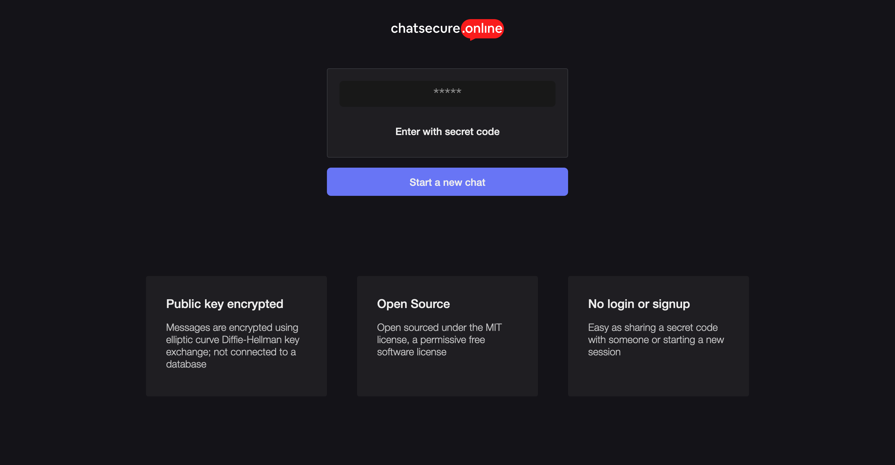

  <h5>When I wrote this, only God and I understood what I was doing. Now, only God knows.</a></h5>
   
  
    
  

    <b>chatsecure.online</b>
    
Start a free secure and private chat with anyone without logging in or signing up
  

  

 

**Public key encrypted:** Messages are encrypted using elliptic curve Diffie-Hellman key exchange; not connected to a database

**No login or signup:** Easy as sharing a secret code with someone or starting a new session

**Save:** Option to save chat history

**Save:** Option to save chat history

## **Demo**

[https://chatsecure.online](https://chatsecure.online)

## **Built with**

- [Svelte Sapper](https://developer.mozilla.org/en-US/docs/Web/HTML)
- [Node](https://developer.mozilla.org/en-US/docs/Web/HTML)
- [Express](https://developer.mozilla.org/en-US/docs/Web/HTML)
- [Sockets.io](https://developer.mozilla.org/en-US/docs/Web/HTML)
- [TweetNacl](https://developer.mozilla.org/en-US/docs/Web/HTML)

#### Local development environment

1. [Clone this repo](https://help.github.com/en/articles/cloning-a-repository) with git.
2. Install dependencies by running `npm install` within the directory that you cloned (`root and client`).
3. Start the development server with `npm run dev`.
4. Open development site by going to [`http://localhost:3000`](http://localhost:3000) in your browser.

## **Contributing**

Please contribute using [GitHub Flow](https://guides.github.com/introduction/flow). Create a branch, add commits, and [open a pull request](https://github.com/hoppscotch/hoppscotch/compare).

Please read [`CONTRIBUTING`](CONTRIBUTING.md) for details on our [`CODE OF CONDUCT`](CODE_OF_CONDUCT.md), and the process for submitting pull requests to us.

## **License**

This project is licensed under the [MIT License](https://opensource.org/licenses/MIT) - see the [`LICENSE`](LICENSE) file for details.

## **Acknowledgements**

- Illustrations from growwwkit
- To these awesome people

<a href="https://github.com/fraggerfox" target="_blank" rel="noopener">

<a href="https://github.com/UnnikrishnanBhargavakurup" target="_blank" rel="noopener">

<a href="https://github.com/antojose" target="_blank" rel="noopener">

<a href="https://github.com/fazfactor" target="_blank" rel="noopener">

